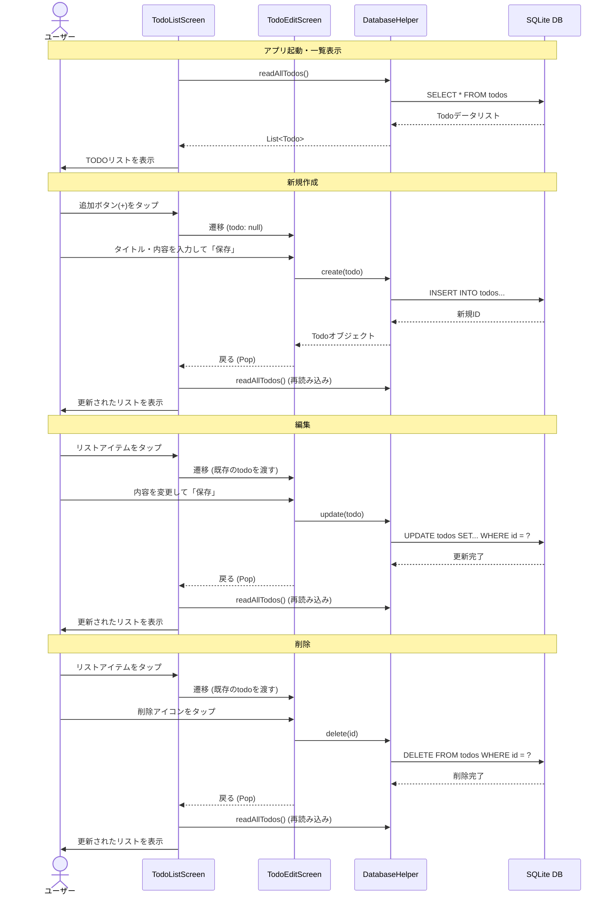

# TODOメモアプリ シーケンス図

この図は、TODOメモアプリの主要な機能（表示、保存、編集、削除）の流れを示しています。

```mermaid
sequenceDiagram
    actor User as ユーザー
    participant ListScreen as TodoListScreen
    participant EditScreen as TodoEditScreen
    participant DB as DatabaseHelper
    participant SQLite as SQLite DB

    Note over User, SQLite: アプリ起動・一覧表示
    ListScreen->>DB: readAllTodos()
    DB->>SQLite: SELECT * FROM todos
    SQLite-->>DB: Todoデータリスト
    DB-->>ListScreen: List<Todo>
    ListScreen->>User: TODOリストを表示

    Note over User, SQLite: 新規作成
    User->>ListScreen: 追加ボタン(+)をタップ
    ListScreen->>EditScreen: 遷移 (todo: null)
    User->>EditScreen: タイトル・内容を入力して「保存」
    EditScreen->>DB: create(todo)
    DB->>SQLite: INSERT INTO todos...
    SQLite-->>DB: 新規ID
    DB-->>EditScreen: Todoオブジェクト
    EditScreen-->>ListScreen: 戻る (Pop)
    ListScreen->>DB: readAllTodos() (再読み込み)
    ListScreen->>User: 更新されたリストを表示

    Note over User, SQLite: 編集
    User->>ListScreen: リストアイテムをタップ
    ListScreen->>EditScreen: 遷移 (既存のtodoを渡す)
    User->>EditScreen: 内容を変更して「保存」
    EditScreen->>DB: update(todo)
    DB->>SQLite: UPDATE todos SET... WHERE id = ?
    SQLite-->>DB: 更新完了
    EditScreen-->>ListScreen: 戻る (Pop)
    ListScreen->>DB: readAllTodos() (再読み込み)
    ListScreen->>User: 更新されたリストを表示

    Note over User, SQLite: 削除
    User->>ListScreen: リストアイテムをタップ
    ListScreen->>EditScreen: 遷移 (既存のtodoを渡す)
    User->>EditScreen: 削除アイコンをタップ
    EditScreen->>DB: delete(id)
    DB->>SQLite: DELETE FROM todos WHERE id = ?
    SQLite-->>DB: 削除完了
    EditScreen-->>ListScreen: 戻る (Pop)
    ListScreen->>DB: readAllTodos() (再読み込み)
    ListScreen->>User: 更新されたリストを表示
```
